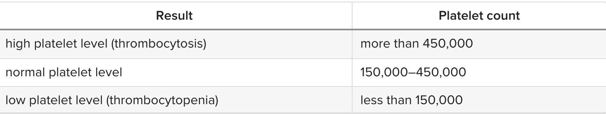
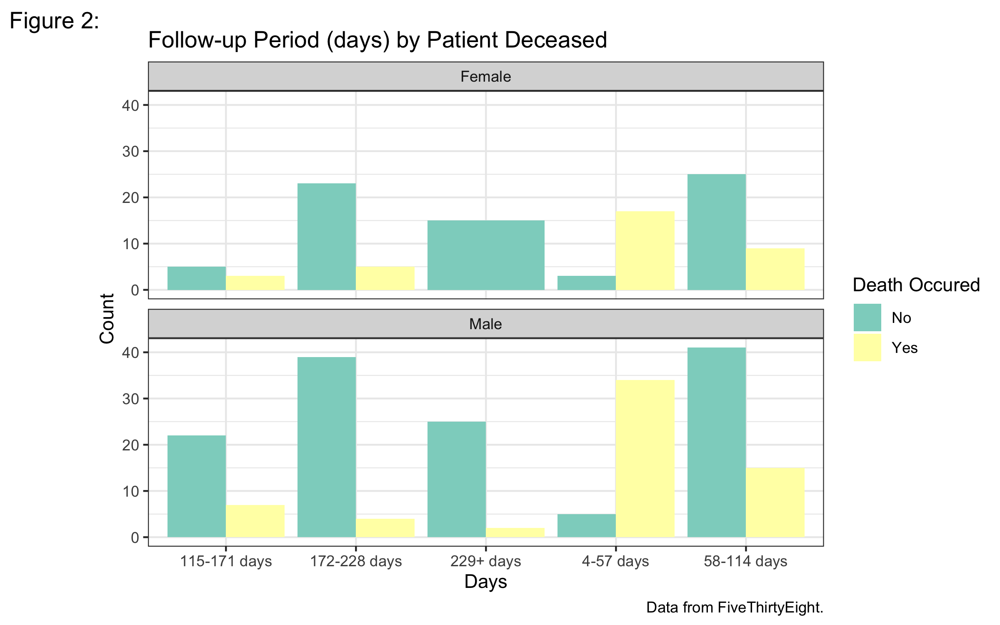
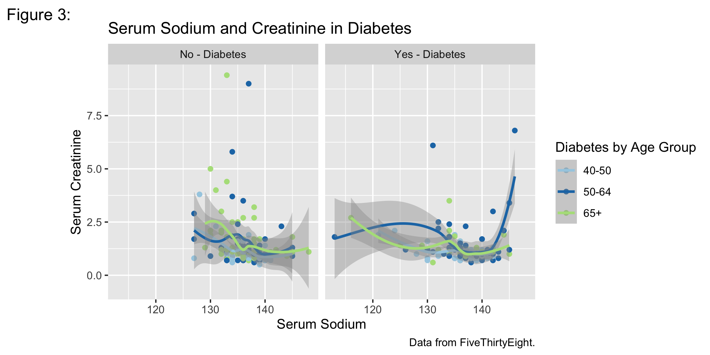

# Cardiovascular Diseases: Heart Failure

- __Project Purpose:__ 
 The data I am using is the heart failures clinical records from Davide Chicco, Giuseppe Jurman. BMC Medical Informatics and Decision Making (2020). Cardiovascular diseases (CVDs) are the number 1 cause of death globally, taking an estimated 17.9 million lives each year, which accounts for 31% of all deaths worlwide.
Heart failure is a common event caused by CVDs and this dataset contains 12 features that can be used to predict mortality by heart failure.

Most cardiovascular diseases can be prevented by addressing behavioural risk factors such as tobacco use, unhealthy diet and obesity, physical inactivity and harmful use of alcohol using population-wide strategies.

People with cardiovascular disease or who are at high cardiovascular risk (due to the presence of one or more risk factors such as hypertension, diabetes, hyperlipidaemia or already established disease) need early detection and management wherein a machine learning model can be of great help.

To create visualizations of the variables to determine if there can be a prediction made or any influences in the the type of variables given. To discover new findings that could be used for further research.

- __Tools used:__ 
I'll be using R in VSCode to complete this project and background of the body's production and definition of each variables
    - https://www.medicalnewstoday.com/articles/322726
    - https://www.mountsinai.org/health-library/tests/creatine-phosphokinase-test
    - https://www.kidney.org/content/heart-kidney-health-3-blood-tests-ask


- __Results:__ This is your conclusion.  Explain why your work matters.  How could others use it?  What are your next steps? Show some key findings.


- Shown in Figure 1, I created a scatter plot of Platelets and Creatine Phosphokinase (CPK) by creating a group for the ages ranging from 40-50, 50-64, and 64+ and seperating them by gender. 

- __Platelets__: Platelets in the blood (kiloplatelets/mL)


- __Creatinine Phosphokinase__: Level of the CPK enzyme in the blood (mcg/L)
    - When the total CPK level is very high, it most often means there has been injury or stress to muscle tissue, the heart, or the brain.
    - Total CPK normal values:
    10 to 120 micrograms per liter (mcg/L)
    - https://www.mountsinai.org/health-library/tests/creatine-phosphokinase-test

- __Age_Group__: ages ranging from 40-50, 50-64, and 64+




- __Death Occured (Death_Event)__: If the patient deceased during the follow-up period
- __New_Time__: Follow-up period (days) with a total of 285 divided into the intervals of 5.




- __Age_Group__: ages ranging from 40-50, 50-64, and 64+
- __Diabetes__: If the patient has diabetes
- __Serum Sodium__: Level of serum sodium in the blood (mEq/L)
- __Serum Creatinine__: Level of serum creatinine in the blood (mg/dL)

## Folder structure

```
- readme.md
- scripts
---- readme.md (short description of each script)
---- data_munge.R
---- data_munge.py
---- eda.R
---- model.py
- data (less than 100 Mb)
---- readme.md (links to data larger than 100 Mb and data details.)
---- crimes.csv
---- visits.json
- documents
---- readme.md (notes while doing your project)
---- mlmethod.pdf
---- api_guide.pdf
```

## Writing about data science

[Thusan's article on how writing about data science is not easy](https://towardsdatascience.com/lets-admit-it-writing-about-data-science-is-not-easy-37a376777d36) could be helpful as you document your project and skills.

## Data sources

You don't need to make these projects complicated. These projects are built to show your work using the skills you have developed during the course. I would make sure that these are presentable in your Github space. You want to demonstrate your creativity. You could use the following links to find a new data set. 

- [FiveThirtyEight](https://github.com/fivethirtyeight/data)
- [TidyTuesday](https://github.com/rfordatascience/tidytuesday)
- [WorkoutWednesday](http://www.workout-wednesday.com/)
- [Kaggle](https://www.kaggle.com/datasets)
- [data.world](https://data.world/search?context=community&entryTypeLabel=dataset&q=free+data&type=all)

## Github pages

It would help if you took the time to publish your repo for easier viewing of the files.  Please follow the directions at [Github pages](https://pages.github.com/) to build your pages footprint on the internet.

## Questions

### Is the expectation of our personal projects similar to that of the class projects we are completing?

Yes & No. Here are a few points to highlight the comparison

1. Three different data sets is the main criteria. Hopefully different challenges to your skills and the data can be in the same area for all three if you desire.
2. You can choose the language. Please choose based on where you want employment.
3. We don't get much into the story telling with our class projects.  But, I would hope you tell a story that includes some graphs and analysis.
4. Think of these as sales pitches for future employment. Your personal projects should be in your own Github space.
